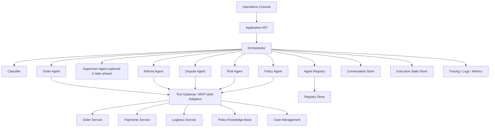

# Architecture

## 1. Why this application

The article argues that enterprise AI systems outgrow single-agent designs when they need specialization, governance, extensibility, and reliable integration with business systems. A merchant operations copilot is a practical example because it combines:

- Multiple business domains with different policies
- Sensitive operational decisions
- Human-in-the-loop review
- Strong audit requirements
- Frequent tool usage across internal systems

## 2. Product definition

We will demonstrate an internal web application used by merchant support and operations teams. The app accepts natural-language requests and coordinates multiple agents to answer or propose actions for:

- Order issues
- Refund and compensation decisions
- Disputes and chargebacks
- Shipment delays
- Merchant risk and policy checks

## 3. Target system architecture

## 4. Core components

### Orchestrator

Responsibilities:

- Accept the user request and session context
- Invoke the classifier
- Select candidate agents through the registry
- Manage multi-step execution and timeouts
- Merge agent outputs into a final response
- Persist audit and execution metadata

Key production behaviors:

- Structured execution plan per request
- Retry and fallback policy
- Idempotent request handling
- Budget and latency controls

### Classifier

Responsibilities:

- Detect user intent
- Estimate confidence
- Decide whether the task is single-domain or multi-domain
- Return `unknown` when confidence is too low

Design:

- Start with rules plus a compact model or heuristic layer
- Escalate to a stronger model when confidence is insufficient
- Emit structured routing hints, not free-form prose

### Agent Registry

Responsibilities:

- Store agent metadata and capabilities
- Resolve which agents can satisfy a task
- Support future dynamic registration

Agent metadata example:

- Agent id
- Supported intents
- Required tools
- Risk level
- SLA target
- Output schema

### Specialized agents

Initial agents:

- Order Agent: order lifecycle, delivery status, fulfillment history
- Refund Agent: refund eligibility, compensation recommendation, payment events
- Dispute Agent: chargeback and evidence workflow
- Risk Agent: merchant health, anomaly checks, abuse indicators
- Policy Agent: policy lookup and citation extraction

Agent contract:

- Input: task payload, user context, session context
- Output: structured JSON with `summary`, `evidence`, `recommended_action`, `confidence`, and `citations`

### Tool Gateway

Purpose:

- Present external systems through stable typed interfaces
- Make local stubs easy during demo development
- Preserve the option to move to MCP or remote tool servers later

Initial tool adapters:

- `getOrder(orderId)`
- `getRefundHistory(orderId)`
- `getShipmentStatus(orderId)`
- `getDispute(disputeId)`
- `searchPolicy(query)`
- `createCaseNote(caseId, note)`

### Data stores

Conversation store:

- User requests
- Final responses
- Referenced agents
- Visible citations

Execution state store:

- Execution graph
- Step status
- Tool calls
- Errors and retries

Registry store:

- Agent metadata
- Versioned capability definitions

## 5. Production-level concerns

This demo should visibly model real-world concerns instead of hiding them:

- Authentication and role-based access boundaries
- PII-aware logging rules
- Structured traces for each orchestration step
- Deterministic typed outputs between components
- Graceful degradation when one agent or tool fails
- Human review gates for risky recommended actions
- Replayable test fixtures for agent and tool behavior

## 6. Recommended implementation shape

### Frontend

A focused operations console with:

- Request composer
- Execution timeline
- Final answer panel
- Evidence and citations panel
- Agent activity drawer

### Backend modules

- `src/server/orchestrator`
- `src/server/classifier`
- `src/server/registry`
- `src/server/agents`
- `src/server/tools`
- `src/server/store`
- `src/server/observability`

### API surface

- `POST /api/copilot/query`
- `GET /api/executions/:id`
- `GET /api/agents`

## 7. Suggested vertical slices

### Slice 1

Single request path for order plus refund analysis with stubbed data.

### Slice 2

Add dispute and policy agents, multi-agent fan-out, and execution timeline UI.

### Slice 3

Add persistent storage, replay tests, and observability.

### Slice 4

Add human approval checkpoints and richer tool adapters.
